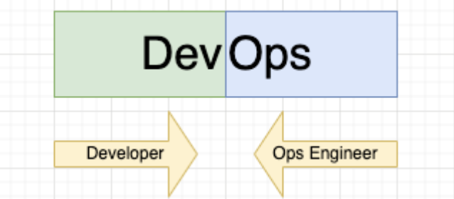

# Coaching | SCTP in SE | Module 4 | DevOps Week 1

Coverage:

<details>
<summary>1. DevOps is first a mindset, then toolchain</summary>

## <u>The Problem of Dev and Ops being separate team</u>

- Dev and Ops are two separate disciplines
- Development Team (Dev) is responsible for producing feature / bug fix
- Ops Team is responsible for releasing tested code into production

> Ponder: After features are developed, Dev hands over to Ops for deployment and continuous monitoring in production. What could go wrong?

> Ponder: What do you think are the challenges in merging two disciplines into one?

## <u> Principles of DevOps </u>

- Maintain version control on all production artifacts
- Implement CI/CD
- Automate acceptance testing of specifications of the system
- Enforce peer review processes
- Create a culture of high trust
- Instate proactive monitoring practices
- Foster win-win relationships across the organization

## <u> Benefits of DevOps </u>

- Speed
- Rapid Delivery
- Reliability
- Scale
- Improved Collaboration
- Security

## <u>When Dev and Ops comes together...</u>



In the beginning, DevOps engineers are transitted from either Development of Operational background. Hence, a DevOps engineer would either lean more towards development or operations. 

> Ponder: What knowledge and skillsets do you think are essential to make a great DevOps Engineer?

</details>

<details>
<summary> 2. DevOps Enable The Shift-left Initiatives </summary>


- DevOps enables test automation
- Test automation enables fast feedback loop should there be failure
- This means Business Analyst / Product Owner is able to define test cases before development (commonly [BDD](https://www.browserstack.com/guide/what-is-bdd))
- Developers is able to adopt the [red, green, refactor](https://medium.com/@tunkhine126/red-green-refactor-42b5b643b506) approach to develop user stories 

</details>

<details>

<summary> 3. Branching Strategies </summary>

Popular Branching Strategies:

1. Git Flow [Link](https://miro.medium.com/v2/resize:fit:1400/1*3-0EDzE63S_UZx2KbIz_dg.png)
1. GitHub Flow [Link](https://cdn.hashnode.com/res/hashnode/image/upload/v1668070000889/rvf5Hx764.png)
1. GitLab Flow [Link](https://media.licdn.com/dms/image/C4E12AQFo229gEeSTKw/article-inline_image-shrink_1500_2232/0/1620932570960?e=1717027200&v=beta&t=6FXLtYyYj2qaBZxzWzzHxZg9ZSlF-HfCCVhFUHVKqqc)
1. Trunk Based Development [Link](https://www.optimizely.com/contentassets/569ac3ee0b124da19a5ac9ea2e8b2b4d/trunk-based-development.png)

> Ponder: How does branching strategies affect how you configure CICD?

</details>

<details>
<summary>4. GIT Command Challenge</summary>

## <u>Use Case</u>

You are part of a development team that uses GitHub Flow. Your tech lead has assigned you a feature and has created a branch for you `feature/feat-111-login-with-google-sso` and you have successfully cloned this branch into your local machine using the following command:

```
git clone https://github.com/your_organization/my_project
cd my_project
git checkout feature/feat-111-login-with-google-sso
code . # you started a visual code to work on the feature
```

Now, you have completed the feature and is ready to commit your changes and push it back to the same branch remotely. What should your GIT commands be?

```sh
# Your input
```
</details>

<details>
<summary> 5. Install Docker </summary>

[Docker](https://docs.docker.com/desktop/)

</details>
